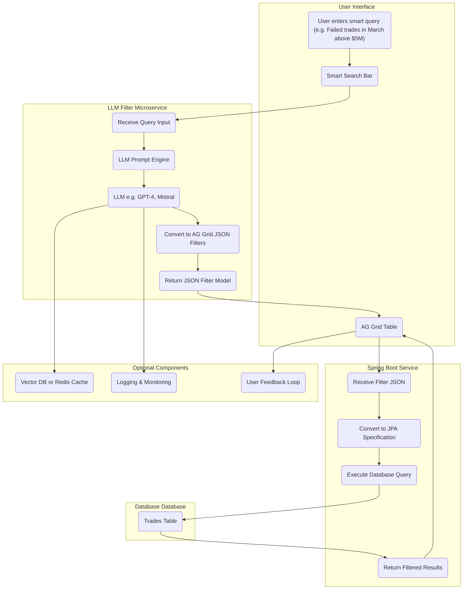

# llm-filtering-microservice

https://github.com/satishsinghpbh/llm-filtering-microservice.git

# Smart Search + LLM-Based Filter Conversion Architecture

This document describes the architecture for a smart search feature that uses natural language processing (NLP) with Large Language Models (LLMs) to convert user queries into structured filter criteria for a trading platform.

---

## 🟨 1. **User Interface (Frontend Layer)**

### Components:
- **AG Grid Table**: Displays filtered trade data.
- **Smart Search Bar (text input)**: The user can type a query to filter trade data.
- **Search Button**: Initiates the search process by submitting the query.

### User Action:
- **Example Query**: "Show failed trades from March for counterparty ABC above 5 million"
- The user clicks the **Search** button to initiate the query.

### Communication:
- A **POST request** is sent to the **LLM Filter API** with the natural language query.

---

## 🟦 2. **LLM Filter Microservice (Middle Layer – Intelligence Engine)**

### Tech Stack:
- **Backend Framework**: Python (FastAPI or Flask) or Node.js
- **AI Framework**: LangChain / Semantic Kernel
- **LLMs**: OpenAI GPT-4 / Mistral / LLaMA 3

### Steps:
1. **Receive Natural Language Query**:
   - Example: "Show failed trades from March for counterparty ABC above 5 million"
   
2. **LLM Prompt Template**:
   - The query is passed to a predefined prompt template that converts the natural language input into a structured JSON format for the AG Grid filters.

3. **LLM Call**:
   - The LLM (e.g., GPT-4) processes the query and returns a structured JSON filter model. 

Example JSON Response:
```json
{
  "status": { "filterType": "text", "type": "equals", "filter": "Failed" },
  "tradeDate": { "filterType": "date", "type": "inRange", "dateFrom": "2025-03-01", "dateTo": "2025-03-31" },
  "counterparty": { "filterType": "text", "type": "contains", "filter": "ABC" },
  "amount": { "filterType": "number", "type": "greaterThan", "filter": 5000000 }
}
```
3. **Response**:
   - The structured filter model is sent back to the UI for further processing.
  
  -------------------------------------------------------


🟩 3. UI (Post-LLM Response)
Receives the AG Grid filter JSON.

Calls gridOptions.api.setFilterModel(json) to apply filters.

OR (optional):

Sends filters directly to the backend via /api/trades/filter

🟥 4. Backend Service (Spring Boot Layer)
Controller receives filter model.

```java
@PostMapping("/api/trades/filter")
public List<Trade> filterTrades(@RequestBody Map<String, Object> filters) {
    return tradeService.filterTrades(filters);
}
```
Service Layer converts filter model to JPA Specification.

Repository builds dynamic query.

Database queried for matching trades.

🟫 5. Response Flow
Data fetched from Database.

Sent back to UI.

AG Grid renders filtered trade records.

🏗️ Optional Components (Add-ons):
Component	Purpose
Redis / Vector DB	Cache previous LLM query results
Metrics + Logging	Monitor LLM output consistency
LLM Feedback UI	Let user adjust or fix incorrect filters
Retry/Fallback Agent	If LLM fails, prompt for simpler filters
💡 Summary of Flow (Text Diagram Style)

```code
User ➝ Smart Search Input
     ➝ [Frontend]
         ➝ LLM Filter API
               ➝ [Prompt] ➝ LLM ➝ AG Grid JSON Filters
         ⬅ Filter JSON ⬅
     ➝ AG Grid or Backend
         ➝ Spring Boot + JPA Spec
             ➝ Database
         ⬅ Filtered Data ⬅
⬅ UI Shows Filtered Results
```


